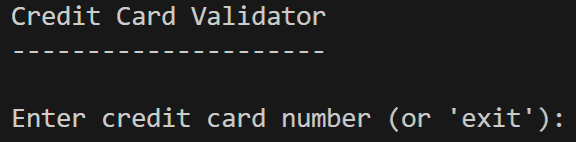

# DIO Credit Card Validation System
Application for simple credit card validation, providing an output with the payment network name based on the card number.

It was developed as a console app to make it easier to execute and test. To do it, simply **clone the repository**, open it on VSCode, and type ***dotnet run*** on the built-in terminal, inside the **DioCardValidator** folder.
After this, you will be running the application, and will see the following message:

Then, simply type the desired card number to check if it's valid, and what is the payment network associated to it.

The output will be in the following format:

**Brand:** *Payment network associated*, unknown if unrecognized or invalid.

**Valid:** *True or False*, based on Luhn algorithm for validation.

**Message:** *Informs if the credit card number is valid or not*, also based on the recognition of the payment network.

This application was developed with AI assistance as requested. The prompts used are inserted in the ***/images*** folder.